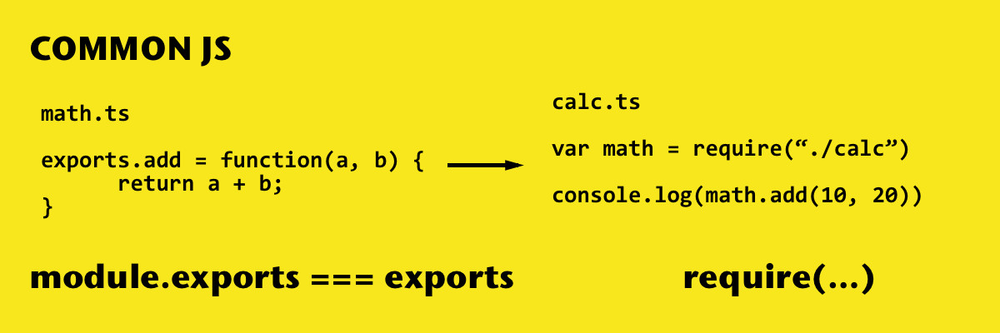

## 细说 Vite 构建 CommonJS 问题



### esm 与 cjs

esm 标准导入模块的方式，是使用写在 js 文件顶层作用域 import 语句，并且模块 id 必须是一个固定的字符串常量。这使得所有行为都是可预测的。这对于 bundler 十分的友好，甚至可以非常轻松的实现 tree-shake 功能。其次导出的模块成员必须是具名的，默认为名字为 default。

cjs 标准导入模块的方式，是使用 require 函数导入模块，require 函数与普通的 js 函数没有什么区别，这就决定了 require 函数可以写在任意的作用域且导入模块 id 可以是任何的 js 变量、字符串常量、表达式。这与 import 语句有着本质的区别，也就是说 cjs(require) 的模块规范要比 esm(import) 模块灵活的多，甚至导出模块成员可以是匿名的；这样的行为差异决定了很多时候一个 cjs 模块是无法有效的转换为 esm 模块的，它们的运行行为差异非常大。

esm 与 cjs 之间的相互导入/导出的转换是所有 bundler/transpiler 都会面临的一个问题，如 Vite、Webpack、esbuild、swc、tsc 等等。关于模块转换有个专有名词叫 interop。

> 我之前在 B 站讲过一个视频 👉🏻 [细讲⚡️vite-plugin-commonjs(上)](https://www.bilibili.com/video/BV1gm4y1e7zK/?vd_source=44b643ef038990a11abb9118def2ef80)

### 作用域 与 同步/异步

Vite(Rollup) 对于构建顶层作用域中使用 import 语句导入的模块是没有作用域概念的，代码的 bundle 规则是基于 export 导出成员的名字，它要求模块作者遵循 esm 规范。这样做理论上不会产生什么副作用，因为模块所有导出成员均在**顶层作用域**且为**同步行为**，所以这就确定了一切行为都是可预测的。

当然如果你使用 import() 函数导入模块，它更像一个普通的 js 函数，并且将不会有顶层作用域限制。导入语句可以写在**任意作用域**且模块导入永远为**异步行为**。Vite(Rollup) 默认是不会将 import() 函数导入的模块合并到 bundle.js 中，如果强行合并到 bundle.js 中可能会导致一些不可预测的副作用，例如用户在被 import() 导入的模块中的顶层作用域立即执行了一些逻辑，这可能会与用户想象中的行为不一致，因为模块会被立即执行！导致执行时机被提前，而不是 bundle.js 由上至下至执行到 import() 函数时候才被加载并执行 👉🏻 [output.inlineDynamicImports](https://github.com/rollup/rollup/blob/v4.17.1/docs/configuration-options/index.md#outputinlinedynamicimports)。

### require 与 import/import()

我们知道了模块导入的作用域，同步/异步的概念后，这将决定了 Vite(Rollup) 能否能顺利的将 require 与 import/import() 转换成功，也即 interop 问题。

<table>
  <thead>
    <th>Statement</th>
    <th>Sync</th>
    <th>Async</th>
    <th>Scope</th>
  </thead>
  <tbody>
    <tr>
      <td>import</td>
      <td>✅</td>
      <td>❌</td>
      <td>Global</td>
    </tr>
    <tr>
      <td>import()</td>
      <td>❌</td>
      <td>✅</td>
      <td>Global / Anywhere</td>
    </tr>
    <tr>
      <td>require()</td>
      <td>✅</td>
      <td>✅ (Wrap with Promise.resolve())</td>
      <td>Global / Anywhere</td>
    </tr>
  </tbody>
</table>

### 模块互操作(interop)

import 语句与 import() 函数很容易转换成 require 且无任何的副作用。

```js
// Global scope

import foo from './foo'
↓↓↓↓ ✅
const { default: foo } = require('./foo')

import * as foo from './foo'
↓↓↓↓ ✅
const foo = require('./foo')

import { bar, baz } from './foo'
↓↓↓↓ ✅
const { bar, baz } = require('./foo')

function func(name) {
  // Function scope

  const foo = import(`./${name}`)
  ↓↓↓↓ ✅
  const foo = Promise.resolve(require(`./${name}`))
}
```

require 函数换成 import 语句可能会失败！

```js
// Global scope

const foo = require('./foo') // 需要配合 Object.defineProperty(exports, "__esModule", { value: true });
↓↓↓↓ 🚧
import foo from './foo'

const foo = require(`./${name}`)
↓↓↓↓ ❌
import foo from `./${name}` // 不支持使用变量

function func(name) {
  // Function scope

  const foo = require(`./${name}`)
  ↓↓↓↓ ❌
  const foo = import(`./${name}`) // `require` 是同步 API
}
```

### 中心化模块管理

Webpack/esbuild 的 bundle 方案支持使用 require 函数导入模块并且可以**无视作用域**。他们能作到这点的主要原因都是采用了模块集中管理的策略；在 Webpack 中所有模块都被挂在到一个名为 `__webpack_modules__` 的变量上并且使用统一 `__webpack_require__` 加载函数加载，在 esbuild 中所有模块均被包裹在一个 `__commonJS` 模块管理函数中，并返回该模块的加载函数。

### Vite 的预处理

Vite 中有个概念是 [Pre-Bundling](https://vitejs.dev/guide/dep-pre-bundling.html#dependency-pre-bundling)，它有一个很重要的作用就是将 cjs 模块提前构建成一个 bundle.js 然后通过 esm 的形式导出模块，这很好的解决了 interop 的问题。试想一下面有一段包含条件导入模块的代码段，让我们看看预构建是如何处理它的。

```js
// add.js
exports.add = (a, b) => a + b

// minus.js
exports.minus = (a, b) => a - b

// math.js
exports.calc = (a, b, operate) => {
  const calc = operate === '+' // condition require
    ? require('./add').add(a, b)
    : require('./minus').minus(a, b)
  return calc(a, b)
}
```

**Output a `bundle.js` file with Vite's Pre-Bundling**

```js
var __commonJS = (cb, mod = { exports: {} }) => function __require2() {
   const cjs_wrapper = Object.values(cb)[0] // wrapper function
   cjs_wrapper(mod.exports, mod); // inject exports, module
   return mod.exports;
};

// add.js
var require_add = __commonJS({
  "add.js"(exports, module) {
    exports.add = (a, b) => a + b
  }
})

// minus.js
var require_minus = __commonJS({
  "minus.js"(exports, module) {
    exports.minus = (a, b) => a - b
  }
})

// math.js
var require_math = __commonJS({
  "math.js"(exports, module) {
    exports.calc = (a, b, operate) => {
      const calc = operate === '+' // condition require
        ? require_add().add(a, b)
        : require_minus().minus(a, b)
      return calc(a, b)
    }
  }
});

// Finally export a esmodule ✅
export default require_math(); // { calc: Function }
```

### Vite 与 Webpack 产物

假设我们有如下两个文件分别为 add.js 与 index.js:

**add.js**

```js
export function add(a, b) {
  return a + b
}
```

**index.js**

```js
import { add } from './add'

const sum = add(1, 2)
```

Vite(Rollup) 默认只支持 esm 格式的文件，也就是模块引用需要使用 import 语句。这个设定很好，因为它是 ECMAScript 的模块标准；同样这会带来一些天然的好处比如很容易支持 tree-shake 这是因为 import/export 语句规定所有导入/导出模块必须写在 js 文件顶层作用域，也即它们的行为可预测的。Rollup 的构建产物给人最直观的感觉就是**所见即所得**，非常符合代码书写的顺序与直觉。

**Bundled with Vite**

```js
// add.js
function add(a, b) {
  return a + b
}

// index.js
const sum = add(1, 2)
```

Webpack 的构建产物是以遵循 cjs 规范的方式组织代码，所以有 **模块中心(modules)、模块导出挂载点(module.exports)、模块加载函数(require)** 等概念。而这些概念在 Rollup 中通通没有；这是两者之间最大的区别，也即两者对模块导入/导出处理的不同。

**Bundled with Webpack**

```js
var __webpack_modules__ = {
  // index.js
  0: (module, exports, __webpack_require__) => {
    const { add } = __webpack_require__(1)
    const sum = add(1 + 2)
  },
  // add.js
  1: (module, exports, __webpack_require__) => {
    function add(a, b) {
      return a + b
    }
    module.exports = { add };
  },
  ...
}

module.exports = __webpack_require__(0)
```

Webpack 首先会为所有会为所有模块提供一个 cjs 外壳代码，并且注入 模块挂载点(module, exports)，模块引入函数(require)。这与 node.js 的模块加载行为完全一致，可以说 Webpack 十分适合构建 Node/Electron 应用，这个场景天然优于使用 Vite(Rollup) 构建。

### 重头戏 C/C++ 模块

C/C++ 扩展是为了 Node/Electron 准备的高性能方案。社区对于构建 C/C++ 模块大部分情况下会使用 node-pre-gyp，node-gyp-build 等工具构建成为 .node 文件，然后放到固定的目录结构中，并且提供一个 bindings 工具用于加载 .node 文件，通常它们可能是这样的：

```js
// node_modules/sqlite3/build/Release/node_sqlite3.node
require('bindings')('node_sqlite3.node');
// node_modules/better-sqlite3/build/Release/better_sqlite3.node
require('bindings')('better_sqlite3.node');
```

C/C++ 构建的 .node 文件本质上是一个 cjs 模块，无论怎样它都不支持使用 import 语句或者 import() 函数加载，所以我们只能使用 require 函数加载它。<!-- 也就是说我们最好以 cjs 格式构建 bundle.js，但是如果我们使用 esm 格式构建 bundle.js 我们需要使用 createRequire 函数创建一个 require 函数并且加载 .node 文件。-->使用 Webpack 工具构建在兼容性上具有天然的优势，因为它们都基于 cjs 格式。且 Webpack 还具有丰富的插件系统。如果使用 Webpack 将 C/C++ 模块构建成一个 bundle.js 并且以一个 esm 模块格式导出，这既能享受 Webpack 强大成熟的生态系统又能做到兼容 Vite(Rollup)。你可以想到这个方法和上面讲到的 预构建(Pre-Bundling) 思路如出一辙，事实却是如此！
